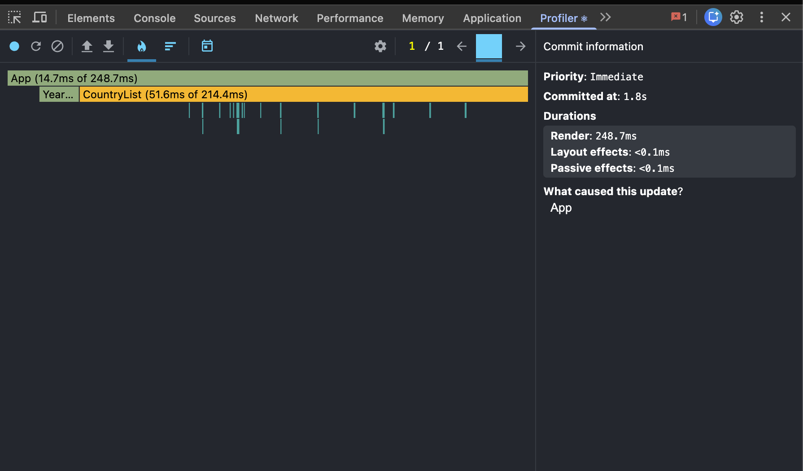
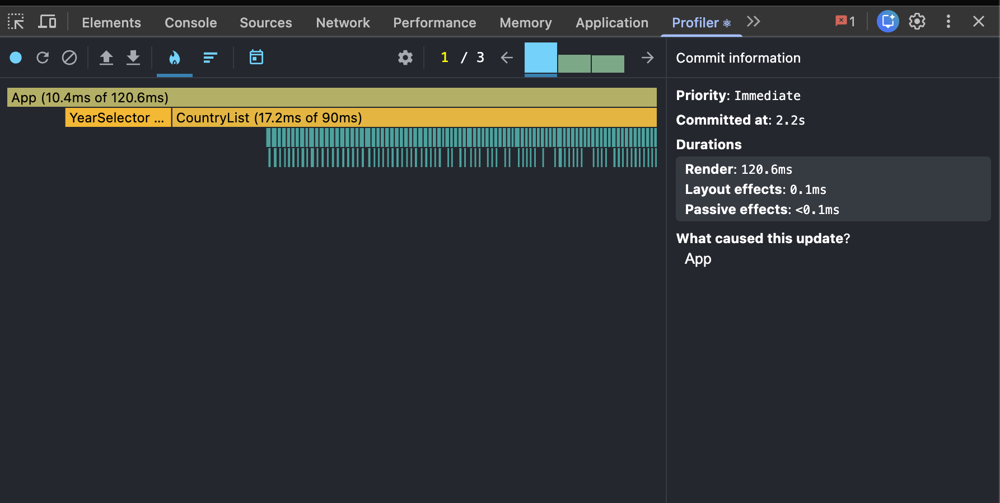
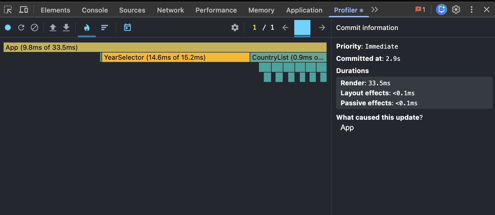
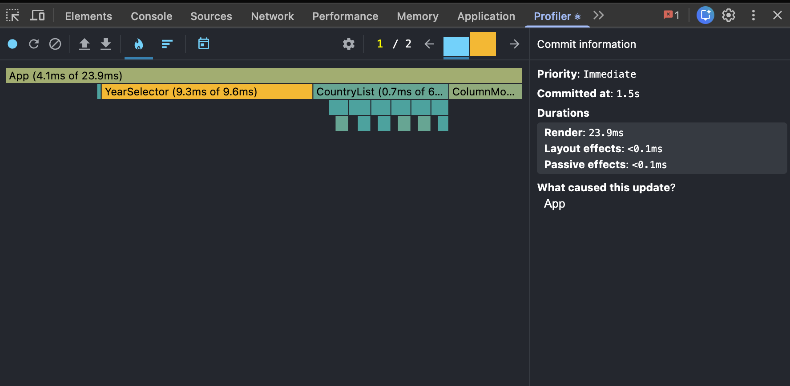
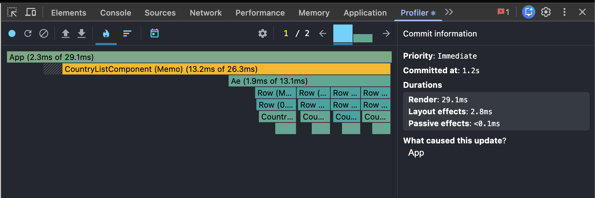
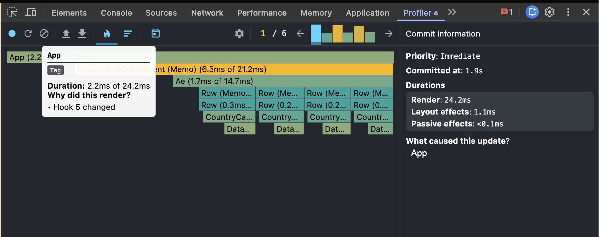
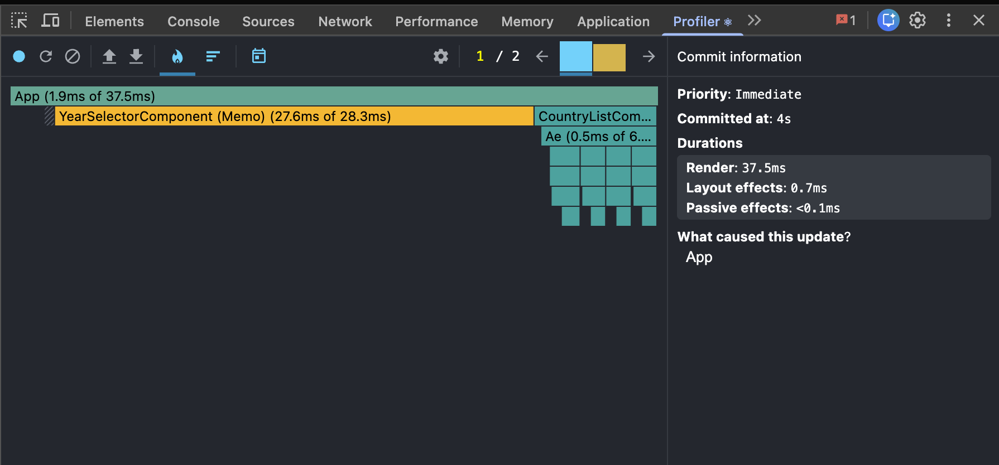
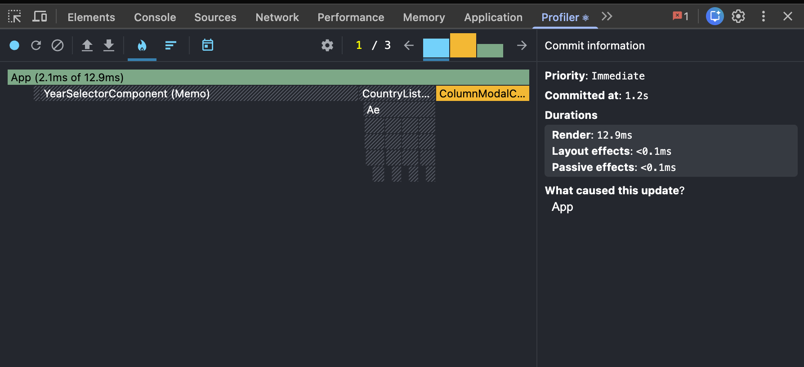

# Performance Report — CO₂ Emissions Data Explorer

This document records the profiling and optimization work for the CO₂ Emissions
Data Explorer. It follows the three required phases:

1. **Phase 1 — Baseline profiling** of the unoptimized app
2. **Phase 2 — Applied optimizations**
3. **Phase 3 — Final profiling** and before/after comparison

## Methodology

- **Tool:** React DevTools **Profiler** tab (browser extension)
- **Build mode:** development (`npm run dev`) — most accurate component-level timing
- **Dataset:** `public/data/owid-co2-data.json` (~86 MB, ~270 countries, full year history)
- **Recorded interactions** (each recorded as a separate Profiler session):
  1. **Sorting** countries (toggle sort order)
  2. **Searching** for a country (type `uni` in the search box)
  3. **Selecting a different year**
  4. **Toggling columns** (open modal, toggle one column)
- **Metrics captured per interaction:** the selected commit's **render duration**
  (the headline number React DevTools shows for the commit), plus the
  **flame chart** screenshot, which also shows the commit duration and the
  per-component render breakdown.
- **Comparison setup:** the unoptimized code lives on the `baseline` branch and
  the optimized code on the `performance` branch, so the exact same interactions
  were profiled against both with identical data.

Screenshots are stored in `docs/screenshots/`.

---

## Phase 1 — Baseline (Unoptimized) — 15 pts

The starter renders **every** country (≈270 cards, each with a data table) on
every state change, recomputes derived data inline, and recreates all handlers
on each render.

### 1. Sorting
- **Render duration:** **248.7 ms**
- Flame chart: 

### 2. Searching
- **Render duration:** **120.6 ms**
- Flame chart: 

### 3. Selecting a different year
- **Render duration:** **33.5 ms**
- Flame chart: 

### 4. Toggling columns
- **Render duration:** **23.9 ms**
- Flame chart: 

---

## Identified Bottlenecks

From the baseline flame charts, the hot paths were:

| # | Location | Problem |
| --- | --- | --- |
| 1 | `app.tsx` | All event handlers recreated each render; `getAvailableYears(data)` (scans every country × year) recomputed on every render. |
| 2 | `country-list.tsx` | `filter + sort` recomputed every render. The `population` sort comparator called `createYearDataMap()` **inside every comparison** → O(n log n) Map allocations. |
| 3 | `country-card.tsx` | Not memoized; `createYearDataMap(country.data)` rebuilt on every render. With ~270 cards, any parent render re-rendered/recomputed all of them. |
| 4 | `data-table.tsx` | Not memoized; `data.filter()` each render; `key={index}`. |
| 5 | lists/tables | `key={index}` used in the country list and the data table → poor reconciliation. |
| 6 | `country-list.tsx` | **No virtualization** — all ~270 cards (each with a table) mounted in the DOM at once. The dominant cost. |
| 7 | `search-bar`, `year-selector`, `column-modal` | Not memoized → re-rendered on every unrelated `App` state change. |

---

## Phase 2 — Applied Optimizations — 70 pts

### `useMemo` for computed values — 12 pts
- `app.tsx`: `years` (memoized on `data`) and `availableColumns` (computed once).
- `country-list.tsx`: `filteredCountries` (filter + sort) memoized on its inputs;
  `rowProps` memoized for `react-window`.
- `country-card.tsx`: `yearDataMap`, `population`, `co2` memoized on
  `country.data` / `selectedYear` (avoids rebuilding the year Map each render).
- `data-table.tsx`: `record` (year lookup) memoized on `data` / `year`.

### `useCallback` for event handlers — 12 pts
- `app.tsx`: `handleSearch`, `handleYearChange`, `handleSortFieldChange`,
  `handleSortOrderToggle`, `handleColumnToggle`, `handleModalToggle` are all
  wrapped in `useCallback` with **empty dependency arrays**, using functional
  `setState(prev => …)` updates so the references stay stable across renders.
  Stable handlers are what allow the memoized children below to actually skip
  re-rendering.

### `React.memo` to prevent unnecessary re-renders — 12 pts
Wrapped: `CountryList`, `CountryCard`, `DataTable`, `SearchBar`, `YearSelector`,
`ColumnModal`. Combined with the stable handlers/props, typing in the search box
no longer re-renders the year selector or the column modal, etc.

### Proper `key` props — 12 pts
- `country-list.tsx`: switched away from array-index keys; rows are driven by the
  **virtualized** list over a stable `filteredCountries` array.
- `data-table.tsx`: rows keyed by the **column name** (`key={column}`) instead of
  `key={index}`.

### Virtualization for the large country list — 22 pts
- Implemented with **`react-window` v2** (`List`) in `country-list.tsx`.
- Only the visible rows (+ small overscan) are mounted instead of all ~270 cards.
- **Measured (DOM evidence):** before optimization the DOM held a table for every
  country (~270 tables); after virtualization only **~4–7 tables** are mounted at
  any time, and scrolling recycles rows.

---

## Phase 3 — Final (Optimized) & Comparison — 15 pts

Same four interactions, same methodology. Improvement is:

```
improvement % = (baseline − optimized) / baseline × 100
```

### 1. Sorting
- **Render duration:** baseline **248.7 ms** → optimized **29.1 ms** → **88.3 % faster**
- Flame chart: 

### 2. Searching
- **Render duration:** baseline **120.6 ms** → optimized **24.2 ms** → **79.9 % faster**
- Flame chart: 

### 3. Selecting a different year
- **Render duration:** baseline **33.5 ms** → optimized **37.5 ms** → **−11.9 % (≈ flat)**
- Flame chart: 

### 4. Toggling columns
- **Render duration:** baseline **23.9 ms** → optimized **12.9 ms** → **46.0 % faster**
- Flame chart: 

---

## Summary

| Interaction | Baseline | Optimized | Improvement |
| --- | --- | --- | --- |
| Sorting | 248.7 ms | 29.1 ms | **88.3 % faster** |
| Searching | 120.6 ms | 24.2 ms | **79.9 % faster** |
| Year selection | 33.5 ms | 37.5 ms | −11.9 % (≈ flat) |
| Column toggle | 23.9 ms | 12.9 ms | **46.0 % faster** |

### Interpretation

- **Sorting (−88 %)** and **searching (−80 %)** improved the most — exactly the
  interactions that previously re-rendered all ~270 cards and (for sorting)
  rebuilt a year `Map` inside every comparison. Virtualization + memoized
  filtering/sorting removed almost all of that work.
- **Column toggle (−46 %)** improved because only the mounted (visible) tables
  re-render, and each `DataTable` is memoized.
- **Year selection (≈ flat, slightly higher)** is the honest exception. Changing
  the year invalidates the population sort, so the optimized build must still
  re-run the `filteredCountries` memo and recompute population for **all** filtered
  countries to re-order them — work that virtualization cannot avoid because
  sorting needs every item. The baseline number here was already low (~33 ms), so
  the ~4 ms difference is within measurement noise. A further optimization would
  be to precompute a population-by-year index once when the data loads, so
  changing the year becomes a cheap lookup instead of a re-sort; that was left out
  to keep the change focused on the required techniques.

**Key structural win:** mounted country cards dropped from **~270 → ~4–7**
(virtualization), eliminating the largest source of render/commit cost, while
memoization + stable handlers removed the cascade of unnecessary re-renders across
the control components on every keystroke and toggle.
